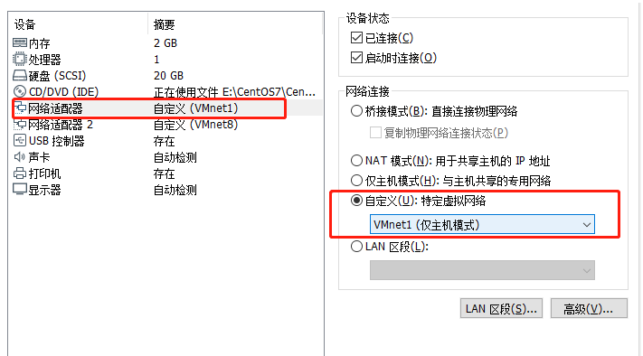
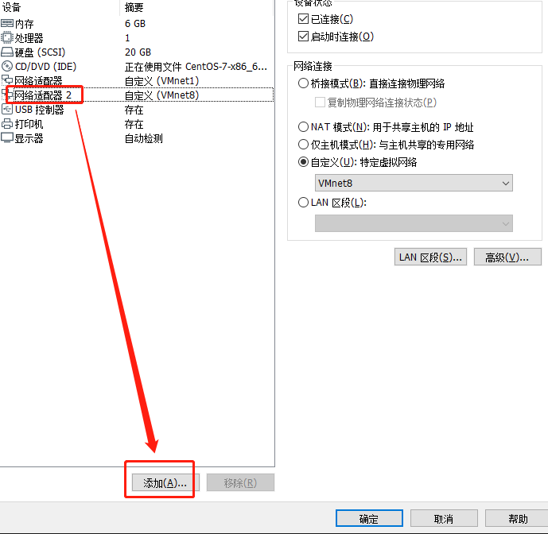
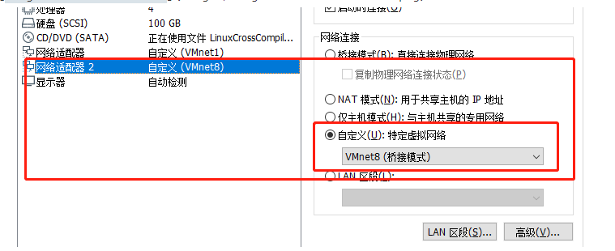
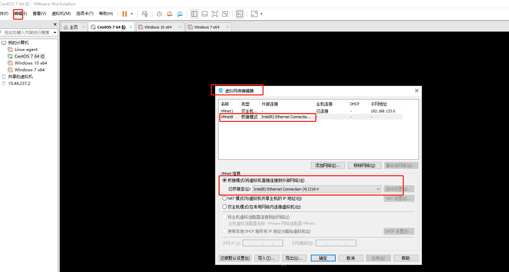

---
header:
  image: /assets/images/image-20220308180127225.png
  teaser: /assets/images/image-20220308180127225.png
title: VMware Network configure
tags:
  - Tool
---

#### overview

when we build a virtual machine with vmware in local host,i wanna do two thing firstly ,the one thing is that i can connect it with ssh tool ,such as  MobaXtem ,another thing is that i can connect to outside network.without futher ado,let's break it down.

+ Connect with ssh tool 

  if we want connet the local host with ssh tool ,we simply configure the netcard into **HOST ONLY MOdE**

  + step 1

    right click the icon in the picture below

  

  + step 2

      select the network adpter and choose host only mode

  
      

  + step 3

    configure the network file in `/etc/sysconfig/network-scripts/`,and set static ip

+ connet outside network

  if we want our local host connect network ,like ping baidu.com ,we can configure the network into **bridge pattern**
    + step 1
  
  right click the icon in the picture below
    
  
    + step 2
  
  add another network adpter

  

+ step 3

  
  + step 4

configure the network file in `/etc/sysconfig/network-scripts/`,and set dynamic ip

